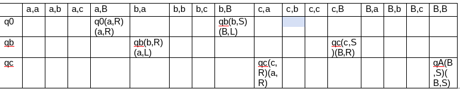
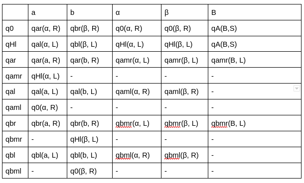

# Practica 1 - Máquinas de Turing (MT)

1. Responder breve y claramente los siguientes incisos:
    a. ¿En qué se diferencia un problema de búsqueda de un problema de decisión?
      * Un problema de decisión es aquel para el que existe una MT que responde SI o NO. En cambio, un problema de búsqueda es más general, el output de la MT no es un acepto o un rechazo, es un resultado
    
    b. ¿Por qué en el caso de los problemas de decisión, podemos referirnos indistintamente a problemas y lenguajes?
      * Un lenguaje es un conjunto de cadena de símbolos que va asociado a un problema, el lenguaje contiene todos los strings para los que la MT "dice" que SI

    
    c. En la clase 1 se presentó el problema de satisfactibilidad de las fórmulas booleanas, en su forma de decisión: 
    *“Dada una fórmula φ, ¿existe una asignación A de valores de verdad que la hacen verdadera?”* Enunciar el problema de búsqueda asociado.
      * En MT de búsqueda me daría la asignación de valores de verdad que hacen a φ verdadera
      * En MT de decisión me diría si existe una asignación de valores que hacen que φ sea verdadera o si no existe
    
    d. Además de la visión de MT que reconoce lenguajes (visión reconocedora), está la visión de MT que los genera (visión generadora). En el caso del problema del inciso anterior, ¿qué lenguaje generaría la MT de visión generadora que resuelve el problema?
      * Generaría un lenguaje con formulas booleanas que además son satisfacibles
    
    e. ¿Qué postula la Tesis de Church-Turing?
      * Postula que todo lo computable puede ser resuelto en una MT
    
    f. ¿Cuándo dos MT son equivalentes? ¿Y cuándo dos modelos de MT son equivalentes?
      * Dos MT son equivalentes cuando para toda MT M1 de un modelo existe una MT M2 equivalente del otro, es decir L(M1) = L(M2). Dos modelos de MT son equivalentes si dada una MT M1 de un modelo, existe otra MT M2 equivalente del otro, por ejemplo, el modelos de MT M1 es 1 cinta y el de MT M2 es de k cintas pero su lenguaje es el mismo

2. Dado el alfabeto Ʃ = {0, 1}:
  a. Obtener el conjunto Ʃ* y el lenguaje incluido en Ʃ* con cadenas de a lo sumo 2 símbolos
      * Ʃ* = {λ, 0, 1, 00, 01, 10, 11}

  b. Dado el lenguaje L = {0^n1^n | n ≥ 0}, calcular Ʃ* ⋂ L, Ʃ* ⋃ L y L^c con respecto a Ʃ*.
      *  Ʃ* ⋂ L = L
      *  Ʃ* ⋃ L = Ʃ*  
      *  L^c = Ʃ* - L

3. En la clase 1 se mostró una MT no determinística (MTN) para aceptar las cadenas de la forma ha^n o hb^n, con n ≥ 0. Construir una MT determinística (MTD) equivalente.

    **Idea general**
    * Se podría utilizar una MT de una cinta y recorrer la cadena, verificando que el primer caracter sea una h y después sea todo a o todo b (o Blanco).

    **Construcción de la MT**
    * Q = {q0, qa, qb, qc}
        * qa: Busco las a
        * qb: Busco las b
        * qc: Verifico si los caracteres son a o b
    * Ʃ = {h, a, b, B}
    * Función de transición δ
      |     | h         | a         | b         | B         |
      |:---:|:---------:|:---------:|:---------:|:---------:|
      | q0  | qc (h, R) |           |           |           |
      | qa  |           | qa (a, R) |           | qA (B, S) |
      | qb  |           |           | qb (b, R) | qA(B, S)  |
      | qc  |           | qa(a, R)  | qb(b, R)  | qA(B, S)  |

4. Describir una MT de K cintas (plantear la idea general, opcionalmente construirla formalmente), que acepte 
de la manera más eficiente posible el lenguaje L = {a^nb^nc^n | n ≥ 0}.

  **Idea General**
  * Se podría utilizar una MT de decisión de dos cintas, en la primera cinta va a estar el input. La idea es recorrer las a de ese input e irlas copiando en la cinta dos, de este modo, podría "contabilizar" las a, las b y las c con el recorrido de la cinta dos. Una vez copiada todas las a, en la cinta uno se empiezan a recorrer las b mientras que en la cinta dos se recorren las a. Cuando en la cinta dos se llega a B, en la cinta uno se debería llegar a la primera c, si esto no es así, la cadena se rechaza. Cuando se verifican los caracteres b, la cinta dos se recorre de derecha a izquierda, y para los caracteres c de izquierda a derecha (para ser más eficiente)

    * Q = {q0, qb, qc}
        + q0: Se copian las a de la cinta uno en la cinta dos
        + qb: Se recorren las b
        + qc: Se recorren las c
    * Ʃ = {a, b, c, B}
    * Función de transición δ
    

5. Explicar (informal pero claramente) cómo simular una MT por otra que no tenga el movimiento S 
(es decir el no movimiento).
  * Para simular el no movimiento, se podría, por ejemplo, hacer que el cabezal vaya a la derecha (R) y después a la izquierda (L). Obivamente sin cambiar el símbolo corriente

6. En la clase 1 se construyó una MT con dos cintas para aceptar el lenguaje L = {w | w ∈ {a, b}* y w es un palíndromo o “capicúa”}. Construir una MT con una cinta para aceptar el mismo lenguaje (la solución que vimos para aceptar el lenguaje de las cadenas a^nb^n, con n ≥ 1, puede ser un buen punto de partida).

  **Idea General**
  * La idea sería leer el primer caracter de la cadena, marcarlo, e ir hasta el último caracter de la cadena y marcarlo también hasta que no queden más caracteres. La idea es que cada vez que marco un caracter de la izquierda, el de la derecha debería ser igual (en este caso a o b)
  **Construcción**
  * Q = {q0, qHl, qar, qal, qamr, qaml, qbr, qal, qbmr, qbml}
    * q0: Buscando a o b a la derecha
    * qHl: Buscando a o b a la izquierda
    * qar: Encuentra una a y va hacía la derecha
    * qal: Encuentra una a y va hacía la izquierda
    * qamr: Encuentra la a del lado derecho, la marca y empieza a buscar hacia la izquierda
    * qaml: Encuentra la a del lado izquierda, la marca y empieza a buscar hacia la derecha
    * qbr: Encuentra una b y va hacía la derecha
    * qbl: Encuentra una b y va hacía la izquierda
  * Ʃ = {a, b, α, β, B}
  * Función de transición δ
    

*Los ejercicios 7. y 8. están resueltos parcialmente al final de la ppt 1*

7. Construir una MT que calcule la resta de dos números (se puede considerar la idea de solución propuesta en la clase 1).
  **Idea general**
  * Propongo el tener una MT de 3 cintas (cinta 1: minuendo, cinta 2: sustraendo, cinta 3: diferencia), lo cuál implicaría copiar parte de la cadena (todos los 1 después del 0) en la cinta 2. El procedimiento es, restar el primer caracter de la cinta 1 con el de la cinta 2 y setear el resultado en la cinta 3, después avanzar hasta llegar a B
  
  **Construcción de la MT**
  * Q = {q0, qa, qb, qc}
    * q0: Posicionarse después del 0 (cinta 1)
    * qa: Copiar esa parte de la cadena en la cinta 2
    * qb: Reposicionar cabezales de la cinta 1 y 2
    * qc: Restar
  * Ʃ = {1, 0, B}
  * Función de transición δ
    1. δ(q0, (1, B, B)) = (q0, (1, R), (B, S), (B, S))
    2. δ(q0, (0, B, B)) = (qa, (0, R), (B, S), (B, S))
    3. δ(qa, (1, B, B)) = (qa, (1, R), (1, R), (B, S))
    4. δ(qa, (B, B, B)) = (qb, (B, L), (B, L), (B, S))
    5. δ(qb, (1, 1, B)) = (qb, (1, L), (1, L), (B, S))
    6. δ(qb, (B, B, B)) = (qc, (B, R), (B, R), (B, R))
    7. δ(qc, (1, 1, B)) = (qc, (B, R), (B, R), (B, R))
    8. δ(qc, (0, 1, B)) = (qc, (0, S), (B, R), (1, R))
    9. δ(qc, (1, B, B)) = (qc, (B, R), (B, R), (1, R))
    10. δ(qc, (0, B, B)) = (qA, (0, S), (B, S), (B, S))

8. Construir una MT que genere todas las cadenas de la forma a^nb^n, con n ≥ 1 (se puede considerar la idea de solución propuesta en la clase 1).

  **Idea general**
  * La idea es al principio setear en la cadena a y b, luego ir a la derecha hasta B y setearlo en a, luego ir al extremo izquierdo de la cinta (sin modificar ningún simbolo) y setear a, luego volver al otro extremo y setear b, y así sucesivamente